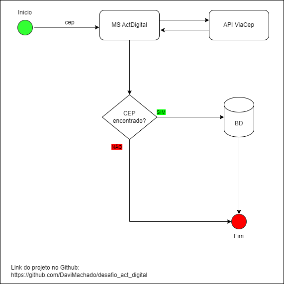
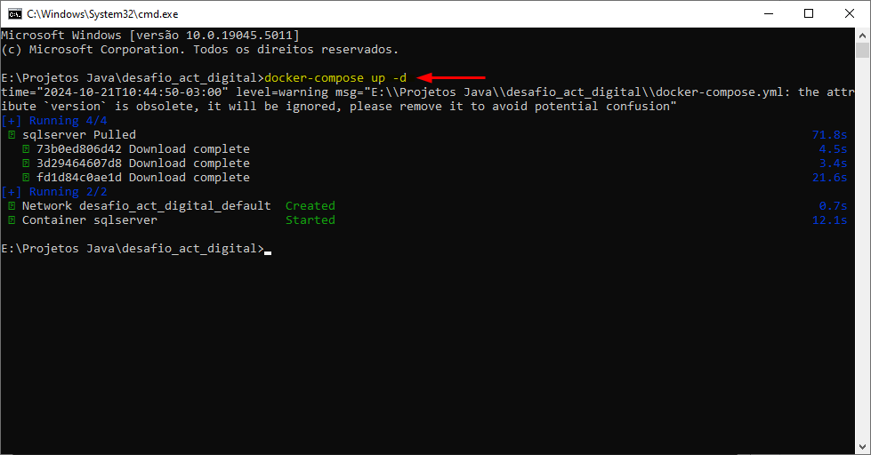
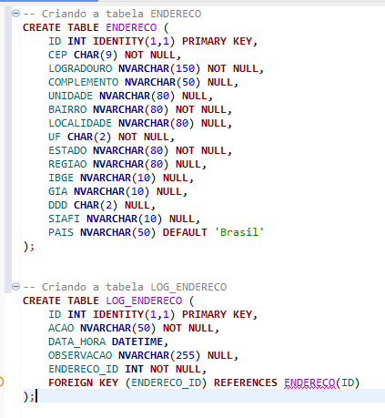
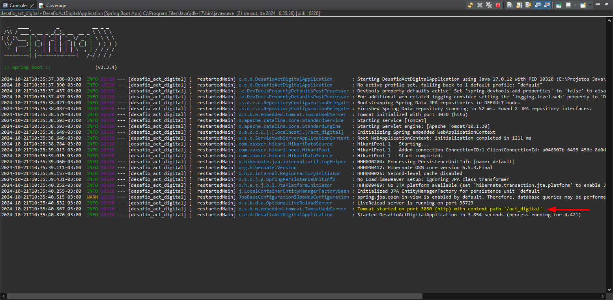
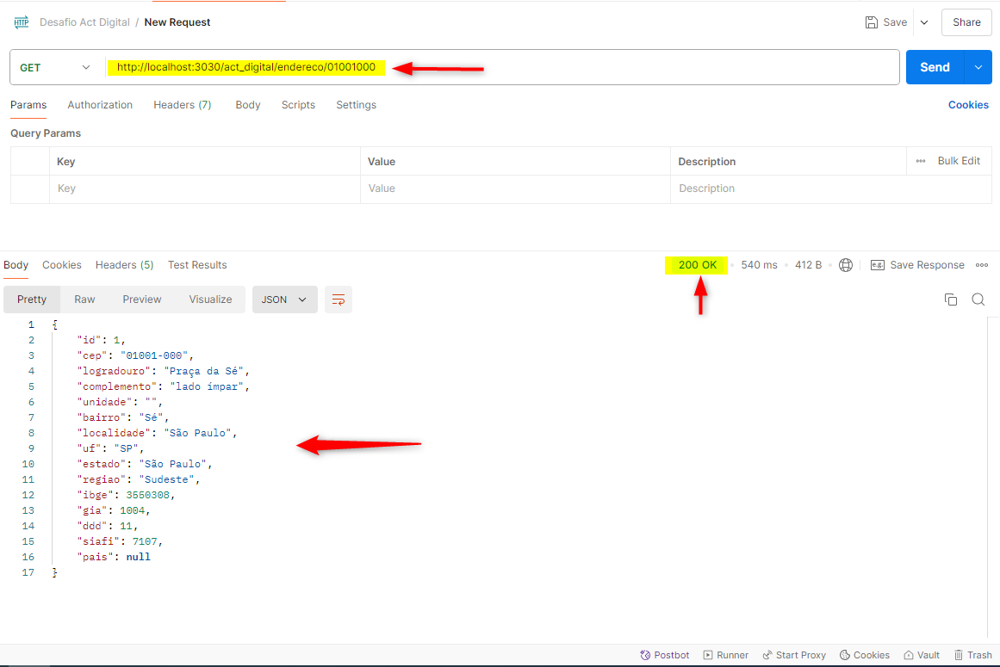
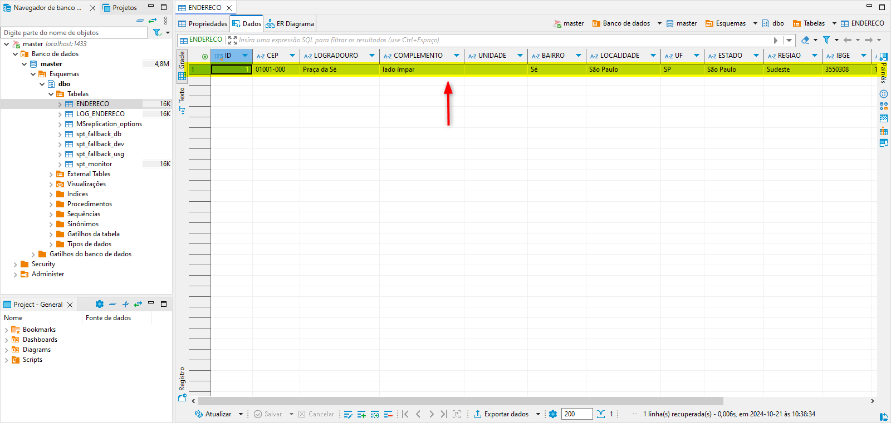
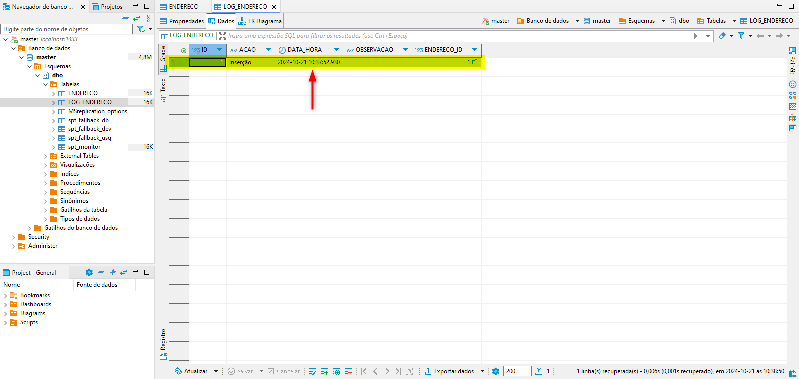
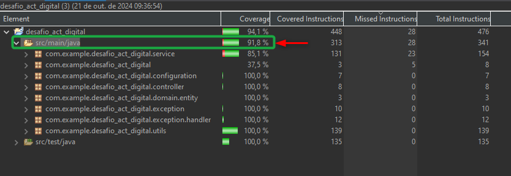

  

# Desafio Técnico - ActDigital  
### Tecnologias Utilizadas:
- Java versão 17
- Spring Boot
- SQLServer
- Docker
- MockServer

## SOLUÇÃO:

### _Passo a Passo para executar o projeto_

1. Clonar o projeto através do [link.](https://github.com/DaviMachado/desafio_act_digital)

2. Em seguida, será necessário executar o comando **"docker-compose up -d"** dentro do diretorio do projeto clonado. (**OBS:** É necessário executar esse comando para subir o container do **SqlServer**).

3. Na sequência, será necessário criar as tabelas **ENDERECO** e **LOG_ENDERECO** no banco de dados. (**OBS:** O microsserviço foi configurado para não realizar a criação das tabelas).

4. Agora será necessário subir o microsserviço que foi clonado na etapa 1.

5. Agora com o auxilio do **Postman**, iremos realizar a requisição para o endpoint **http://localhost:3030/act_digital/endereco/01001000**. (**OBS:** O numero **"01001000"** é o CEP que deseja ser pesquisado na API do ViaCep).

- Em seguida ele irá pesquisar o CEP através da API do ViaCep, e salvar no banco de dados nas respectivas tabelas **ENDERECO** e **LOG_ENDERECO**.

- Por fim, a cobertura dos testes unitários ficou em **91,8%** no **Coverage**.

 

___
___
